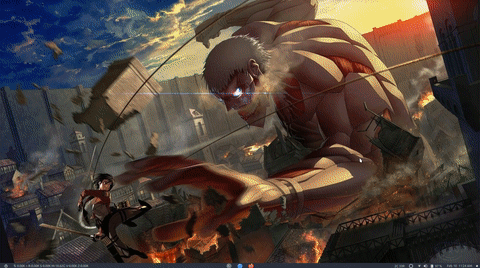
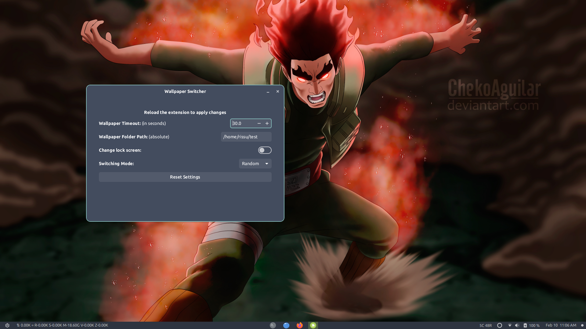

# Wallpaper Switcher

A Gnome extension to change wallpapers after given interval of time.

## Table of Contents

- [Wallpaper Switcher](#wallpaper-switcher)
  - [Table of Contents](#table-of-contents)
  - [Screenshots](#screenshots)
  - [Features](#features)
  - [Getting Started](#getting-started)
  - [Getting Started](#getting-started-1)
    - [Prerequisite: Install Gnome Tweaks](#prerequisite-install-gnome-tweaks)
    - [Prerequisite: Install Gnome Extensions Manager or Gnome Extensions](#prerequisite-install-gnome-extensions-manager-or-gnome-extensions)
      - [Setting Up Gnome Extensions Manager](#setting-up-gnome-extensions-manager)
      - [Setting Up Gnome Extensions](#setting-up-gnome-extensions)
    - [Install Wallpaper Switcher from Gnome Extensions](#install-wallpaper-switcher-from-gnome-extensions)
    - [Install Wallpaper Switcher from source](#install-wallpaper-switcher-from-source)
  - [Contributing](#contributing)
  - [License](#license)
  <!-- - [Updates](#updates) -->
  - [Features](#features)
  - [Getting Started](#getting-started)
    - [Prerequisite: Install Gnome Tweaks](#prerequisite-install-gnome-tweaks)
    - [Prerequisite: Install Gnome Extensions Manager or Gnome Extensions](#prerequisite-install-gnome-extensions-manager-or-gnome-extensions)
    - [Install Wallpaper Switcher from Gnome Extensions](#install-wallpaper-switcher-from-gnome-extensions)
    - [Install Wallpaper Switcher from source](#install-wallpaper-switcher-from-source)
  - [Contributing](#contributing)
  <!-- - [Thanks to](#thanks-to) -->
  - [License](#license)

## Screenshots
<p align="center">
  
  <br/>
  
</p>
<!-- 


 -->

<!-- ## Updates

The new release packs the following new features.

* Added settings for more customization options.
  * You can now choose which side you want your widget to be located.
  * Choose whow much to display 
  * Reset the data used info manually from settings
* Better implemented code. -->

## Features

This extension has following features:

* Easily set a folder containing wallpapers to apply
* Two available modes
  * Sequential : Wallpaper changes in a cyclic order
  * Random : Wallpaper changes in a random order
* Option to set time-delay in seconds

## Getting Started

To use this extension, you will need

- Gnome Shell 3.34 or later

## Getting Started

To use this extension, you will need

- Gnome 42 or later

### Prerequisite: Install Gnome Tweaks

For Ubuntu,

```bash
sudo add-apt-repository universe
sudo apt install gnome-tweaks
```

For Fedora,

```bash
sudo dnf install gnome-tweaks
```

For Arch Linux,

```bash
sudo pacman -S gnome-tweak-tool
```

You may find Gnome Tweaks for other distributions as well. Install them accordingly.

### Prerequisite: Install Gnome Extensions Manager or Gnome Extensions

I recommend using Gnome Extensinos Manager as it would make your life easier. Gnome Extensions needs few extra steps to be done

#### Setting Up Gnome Extensions Manager

For Ubuntu,

```bash
sudo add-apt-repository universe
sudo apt install gnome-shell-extension-manager
```

For Fedora,

```bash
sudo dnf install gnome-shell-extension-manager
```

For Arch Linux,

```bash
sudo pacman -S gnome-shell-extension-manager
```

You may find Gnome Extension Manager for other distributions as well. Install them accordingly.

#### Setting Up Gnome Extensions

For Ubuntu,

```bash
sudo add-apt-repository universe
sudo apt install gnome-shell-extensions
```

For Fedora,

```bash
sudo dnf install gnome-shell-extensions
```

For Arch Linux,

```bash
sudo pacman -S gnome-shell-extensions
```

You may find Gnome Extension for other distributions as well. Install them accordingly.

After installation, open your browser and go to [Gnome Extension Website](https://extensions.gnome.org)

You would be asked to add a browser extension, install the extension. Now you are ready to install Gnome Extensions.


### Install Wallpaper Switcher from Gnome Extensions

If you are using Gnome Extensions Manager then open it and click Browse and search for <b>Wallpaper Switcher</b>

If you are using Gnome Extensions then Visit [Wallpaper Switcher - GNOME Shell Extensions](https://extensions.gnome.org/extension/4585/wallpaper-switcher/)

Now Install it and you are done


### Install Wallpaper Switcher from source

1. Clone this repository

   ```bash
   git clone https://github.com/rishuinfinity/WallpaperSwitcher.git
   ```

2. Change current directory to repository

   ```bash
   cd WallpaperSwitcher
   ```

3. Now run

   ```bash
   chmod +x ./install.sh && ./install.sh
   ```

4. Hit `ALT + F2`, Type `r` and hit `Enter`
   
   If you are on Ubuntu wayland mode, then restart once.

5. Open Gnome Tweaks 

6. Enable Wallpaper Switcher extension in Gnome Tweaks

## Contributing

Pull requests are welcome. For major changes, please open an issue first to discuss what you would like to change.

<!-- ## Thanks to

- This project is modified from [Internet Speed Meter](https://github.com/AlShakib/InternetSpeedMeter) by [Al Shakib](https://alshakib.dev) -->

## License

[GNU General Public License v3.0](LICENSE)

Copyright © 2022- [Rishu Raj](https://github.com/rishuinfinity)
